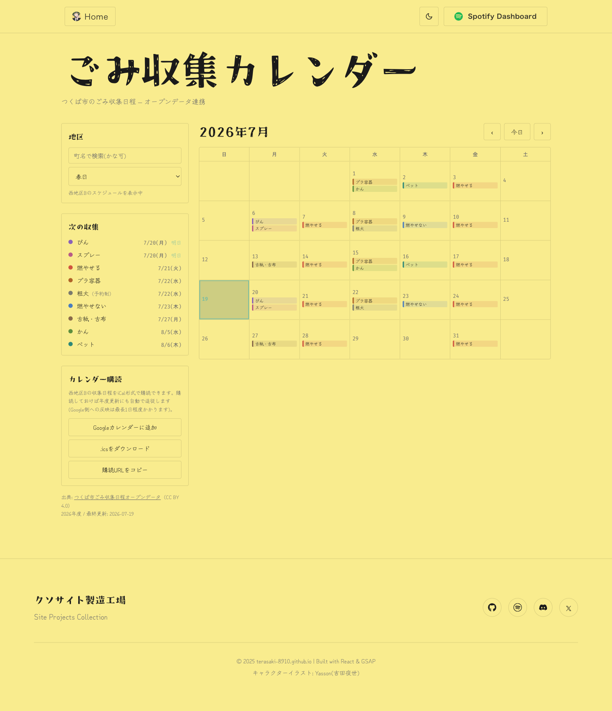
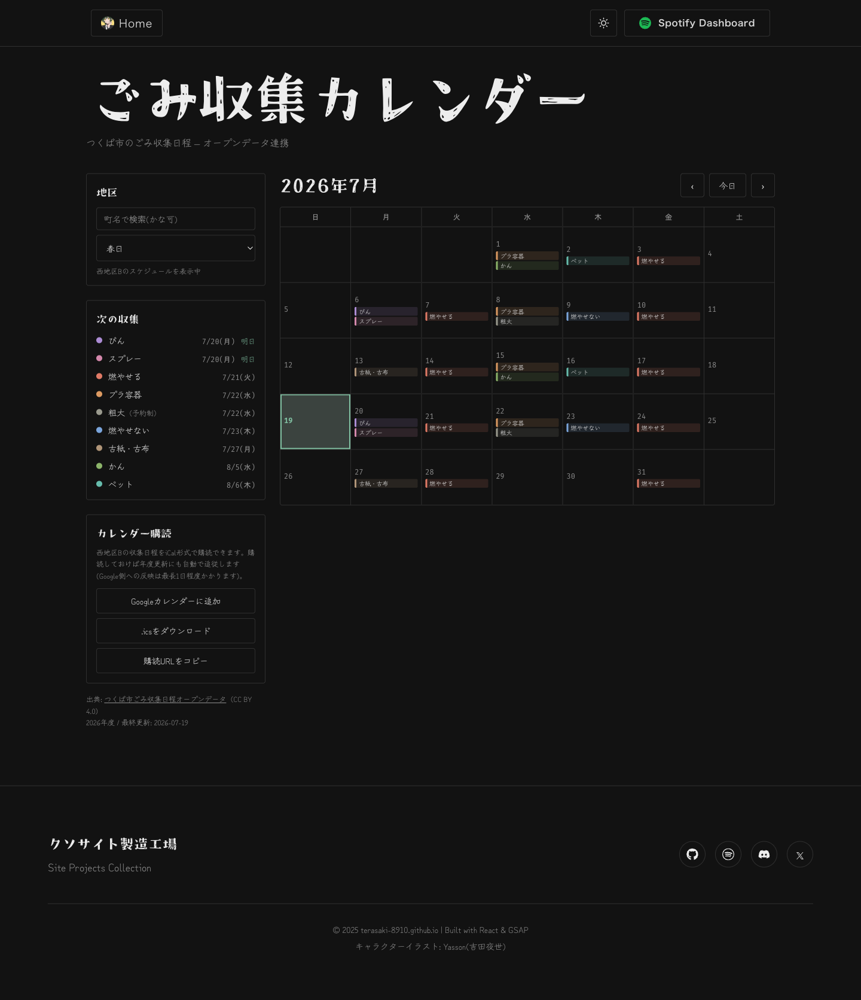
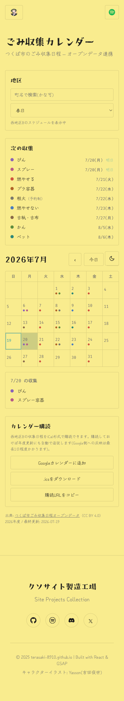

# つくば市ごみ収集カレンダー(/gomi-tsukuba/)実装ドキュメント

このディレクトリは実装の解説専用で、GitHub Pagesの公開物(`docs/`)とは別物。
`docs/`はVite `npm run build`で毎回まるごと再生成される**ビルド成果物**なので、
ここ(`documentation/`)にMarkdownを置いてもビルドで消えない。

対象機能: つくば市が公開するごみ収集日程オープンデータ(CC BY 4.0)を自動取得し、
地区別の月間カレンダー・次回収集アジェンダ・iCal購読を提供するページ。
「単発のゴミ出しUI」ではなく、**サイト共通のカレンダーUI基盤の初テスト**という位置づけで、
ここで確立した設計規約は`~/.claude/skills/calendar-ui/SKILL.md`に汎用知見として切り出し済み。

## 1. システムアーキテクチャ

### 1.1 全体の流れ

```
つくば市サイト(月別xlsx×12)
        │  scripts/update-gomi-calendar.js が週次で取得・解析
        ▼
public/gomi-tsukuba/data.json          ← エリア別日程 + 町→エリアのマッピング
public/gomi-tsukuba/ics/<area>.ics×5   ← エリア別iCal
        │  npm run build (Vite) がpublic/を静的にコピー
        ▼
docs/gomi-tsukuba/{data.json, ics/*.ics, index.html, ...}
        │  GitHub Pagesが静的配信
        ▼
ブラウザ: GomiCalendar.jsxがdata.jsonをfetchして描画
Googleカレンダー等: ics/<area>.icsを直接購読
```

GitHub Pagesはサーバーロジックを一切持てない静的ホスティングのため、
「データ取得→変換→コミット」を担うのはGitHub Actions(`update-gomi.yml`)であり、
ページ自体はビルド時に埋め込まれた静的JSON/icsを読むだけ。

### 1.2 データモデル — 225町ではなく5エリア

xlsxは行=町(225町)だが、**実データを全月・全行検証した結果、収集スケジュールは
5エリア(北地区・南地区・東地区・西地区A・西地区B)単位で完全に一致**することが分かった。
そのため`data.json`は「5エリアの日程」+「225町→エリアの対応表」という2層構造に
圧縮している。UI側もこれに従い、実際に描画するカレンダーは常に5種類のいずれか1つ。

```jsonc
{
  "lastUpdated": "2026-07-19T...",
  "fiscalYear": "2026",
  "source": { "page": "...", "license": "CC BY 4.0", "attribution": "..." },
  "categories": [{ "id": "burnable", "label": "燃やせるごみ" }, ...],
  "areas": {
    "west-b": { "label": "西地区B", "days": { "2026-07-20": ["bin", "spray"], ... } }
  },
  "towns": [{ "n": "春日", "k": "かすが", "a": "west-b" }, ...]
}
```

### 1.3 データパイプライン(`scripts/update-gomi-calendar.js`)

1. 市の案内ページHTMLから月別xlsxリンクを正規表現でスクレイプ(年度が変わってURLの
   年月部分が変わっても自動追従)
2. 各xlsxを`exceljs`でパースし、ヘッダーが既知の9カテゴリと一致するかassert
3. **前提が崩れたら(エリア数が5でない/エリア内でスケジュールが割れる等)`exit 1`で
   失敗させ、既存の`data.json`を上書きしない**(壊れたデータを公開しない安全策)
4. `data.json`とエリア別`.ics`を出力

このスクリプトは`.github/workflows/update-gomi.yml`が毎週月曜6:00 JST(+手動実行/
自身への変更push時)に実行し、差分があれば`GitHub Action`名でコミット・pushする。
このコミット者名は既存のSpotify連携ワークフローと同じ命名規約で、サイトのCommitLog
機能(`vite.config.js`のビルド時git log埋め込み)が自動的にボットコミットを除外する
仕組みにそのまま乗っている。

**決定性の担保**: 初回の実運用で、内容が変わっていなくても実行のたびに全icsファイルが
差分になる問題が発生した。原因は`DTSTAMP`に実行時刻(`new Date().toISOString()`)を
使っていたこと。年度から決定的に導出する値(`${fiscalYear}0401T000000Z`)に変更し、
さらに`lastUpdated`を除いた内容比較で無変化なら一切書き込みをスキップするようにして
解消した。CIで実際に再実行し、ボットコミットが発生しないことまで確認済み。

### 1.4 iCal出力

RFC 5545準拠を意識して手書き実装(外部ライブラリ不使用)。要点:
- 終日イベントは`DTSTART;VALUE=DATE`(タイムゾーン問題を回避)
- CRLF改行、75オクテット折り返し(**UTF-8バイト長基準**で文字境界分割。日本語は
  文字数基準で折り返すと壊れる)
- UIDは安定(`gomi-<area>-<yyyymmdd>-<category>@terasaki-8910.github.io`)
- 生成スクリプト自身がself-check(行長・UID一意性)を行い、壊れたicsを出力しない

### 1.5 フォントサブセット

町名225件+かなはデータ由来でソースコード上のテキストに現れないため、通常の
「ソースの日本語文字を抽出してサブセット化」だけでは収録漏れが起きる。
`public/gomi-tsukuba/data.json`の町名・かなも抽出対象に加えて再生成している。

大きめの文字集合(832文字)ではGoogle FontsのCSS `text=`パラメータAPIが
スライス配信に劣化する挙動を確認したため、`google/fonts`リポジトリからTTF原本を
直接取得し`fontTools.subset`でローカルにサブセット化する方式に切り替えた
(`src/index.css`のコメントに手順を記載)。

### 1.6 SEO

GitHub Pagesは静的配信のみでCSR(クライアントサイドレンダリング)のため、
初回HTMLにはコンテンツがほぼ無い。Home(`index.html`)と同じ`#seo-fallback-content`
パターン(Reactマウント時に丸ごと置き換わる、クローラー向けの静的テキスト)を
`gomi-tsukuba/index.html`にも追加し、OGP/Twitter Card/JSON-LD構造化データも付与した。
「つくば市ごみ収集カレンダー」で一致しやすいよう、URL自体も`/gomi/`から
`/gomi-tsukuba/`へリネームしている(まだ外部購読者がいない段階での変更)。

## 2. UI設計

### 2.1 レイアウトの解剖

Fantastical(参照元)の「サイドバー+メイングリッド」という骨格を踏襲しつつ、
ビューはこの機能に必要な分だけに絞った: 収集日は時刻を持たない日単位データなので、
Fantasticalが持つ日/週ビュー(時間軸グリッド)は情報量ゼロと判断し**実装しない**。
月グリッド+次回収集アジェンダの2本柱のみ。

デスクトップ(`md:grid-cols-[300px_minmax(0,1fr)]`):

```
┌─────────────┬───────────────────────────┐
│ 地区(検索+   │  2026年7月      ‹ 今日 › │
│  select)    │  日 月 火 水 木 金 土     │
│             │  [ 7列 × 罫線ヘアライン   │
│ 次の収集     │    月グリッド ]           │
│ (アジェンダ) │                           │
│             │                           │
│ カレンダー   │                           │
│  購読(iCal) │                           │
│             │                           │
│ 出典表記     │                           │
└─────────────┴───────────────────────────┘
```

モバイルは縦積みで「地区選択 → 次の収集 → 月グリッド → タップした日の詳細カード →
購読 → 出典」の順(スクリーンショット参照)。

### 2.2 月グリッド(`MonthGrid.jsx`)

- 7列CSS Grid。罫線は`gap-px`+親`bg-line`+セル`bg-paper`のヘアライン方式(1px罫線を
  ボーダーではなく背景色の透かしで表現する、サイト全体で使っている手法)
- 月初/月末の空セルは何も描かない(隣接月の日付を出さない — データが無い月に
  ユーザーを誘導しないため)
- 月ナビはデータの存在範囲でクランプし、範囲外の矢印は`disabled`
- 「今日」はアクセント色(celeste)の`ring-2 ring-inset`、選択中セルは
  `bg-celeste-dim`。両方とも`bg-paper`との排他制御が必要で、Tailwindでは
  不用意に両方のクラスを条件付きで並記すると宣言順でどちらが勝つか予測できなくなる
  ため、三項演算子1本で出し分けている
- 日セルは実`<button>`で`aria-label="7月21日: 燃やせるごみ、かん"`+`aria-pressed`

**デスクトップとモバイルで情報量を出し分け**ている点が今回の実測での発見:
- デスクトップ: 短縮カテゴリラベルのチップを最大3件+「+n」。チップは
  「左ボーダー3px(カテゴリ色) + `color-mix(in srgb, 色 14%, transparent)`の
  淡い背景 + ink文字」という構成(下地に応じて自動で薄くなるためテーマごとの
  RGBA値を個別に持たなくて済む)
- モバイル: 情報を圧縮し、カテゴリ色ドット最大4件+超過表示のみ。全カテゴリの
  詳細はセルに詰めず、タップ後に下に出る`DayDetail`カードで初めて見せる

### 2.3 配色 — 「データの意味色」というレイヤー

サイト全体の方針は「アクセントはceleste 1色のみ」だが、ごみカテゴリの9色は
装飾ではなく**データの意味を担うdataviz層**であるため、この方針の対象外として
明示的に別レイヤーで扱っている。UIの操作状態(hover/選択/今日リング)は
celeste・中性色のみを使い、カテゴリ色と混ざらないようにしている。

カテゴリ色はライト/ダーク両テーマで`--gomi-<id>`としてCSS変数定義
(`src/index.css`)。背景がペール黄(#F9EC8E)のため黄系の色相は使っていない。
非テキスト用途(チップの縁取り・ドット)でもWCAG非テキストコントラスト
(SC 1.4.11、3:1)を実測で検証し、`pet`/`plastic`は当初案から彩度・明度を
調整して基準をクリアさせている。

### 2.4 地区(町)ピッカー(`TownPicker.jsx`)

225町をエリアごとに`<optgroup>`でグルーピングしたネイティブ`<select>`から
出発したが、実際にユーザーが触ってみると一覧が長すぎて使いにくいというフィード
バックがあり、上に町名/かなで絞り込む検索テキスト入力を追加した。
`<select>`自体の構造(value/onChange・optgroup)は変えず、「JS側で表示する
`<option>`を絞り込むだけ」という最小変更にしている(ネイティブselectのモバイル
ピッカー・キーボード操作・スクリーンリーダー対応をそのまま維持するため)。

- 現在選択中の町は検索語に一致しなくても常に選択肢に残す(検索中に選択が
  消えたように見える事故を防ぐ)
- 一致0件のときは「「◯◯」に一致する町がありません」を表示

### 2.5 次回収集アジェンダ(`NextPickupList.jsx`)

Fantasticalの「TODAY/TOMORROW」リストを翻案。9カテゴリ全てについて
「今日以降で最も近い収集日」を計算し、日付が近い順に並べる。今日/明日は
celesteのバッジで強調。粗大ごみのみ「（予約制）」の注記を残す。

### 2.6 iCal購読ウィジェット(`IcsSubscribe.jsx`)

選択中エリアに対して「Googleカレンダーに追加」(`calendar.google.com/calendar/render?cid=<エンコード済みics URL>`)・
「.icsをダウンロード」・「購読URLをコピー」の3導線+「反映は最長1日程度」の注記。
配信URLはdevサーバーで見ていても常に本番の絶対URLを使う(Google側から取得できる
必要があるため)。

## 3. スクリーンショット

### デスクトップ・ライトテーマ


### デスクトップ・ダークテーマ


### モバイル・日付タップ詳細


## 4. 関連ファイル

| 役割 | パス |
|---|---|
| データパイプライン | `scripts/update-gomi-calendar.js` |
| 自動更新workflow | `.github/workflows/update-gomi.yml` |
| ページエントリ | `gomi-tsukuba/index.html`, `src/gomi-main.jsx`, `src/GomiPage.jsx` |
| カレンダー本体 | `src/components/gomi/GomiCalendar.jsx` |
| 月グリッド | `src/components/gomi/MonthGrid.jsx` |
| アジェンダ | `src/components/gomi/NextPickupList.jsx` |
| 地区ピッカー | `src/components/gomi/TownPicker.jsx` |
| iCal購読UI | `src/components/gomi/IcsSubscribe.jsx` |
| カテゴリ定数 | `src/data/gomiCategories.js` |
| 日付ヘルパー | `src/utils/gomiDate.js` |
| カテゴリ色トークン | `src/index.css`(`--gomi-*`) |
| 汎用カレンダーUI設計知見 | `~/.claude/skills/calendar-ui/SKILL.md` |
